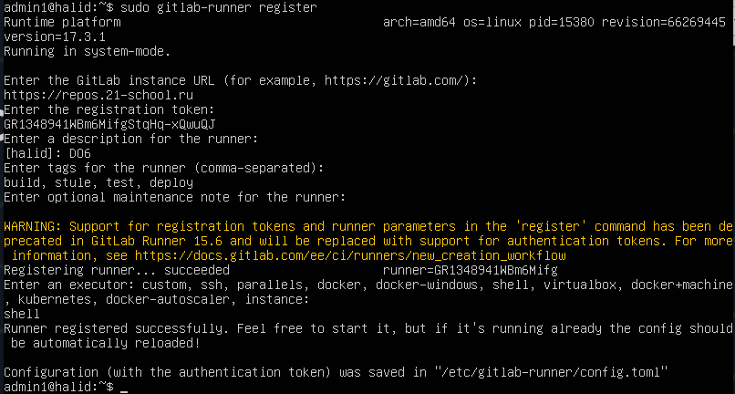
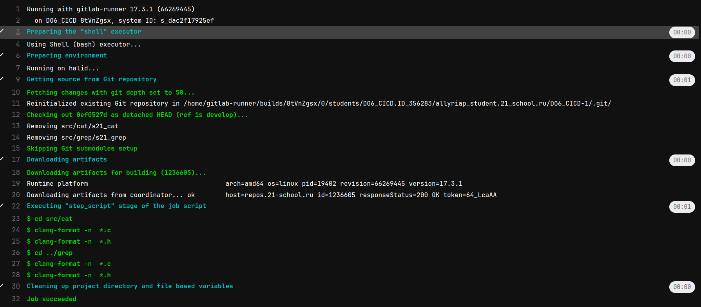

# Basic CI/CD

Разработка простого **CI/CD** для проекта *SimpleBashUtils*. Сборка, тестирование, развертывание.

## Contents

1. [Chapter III](#chapter-iii) 
   1. [Настройка gitlab-runner](#part-1-настройка-gitlab-runner)  
   2. [Сборка](#part-2-сборка)  
   3. [Тест кодстайла](#part-3-тест-кодстайла)   
   4. [Интеграционные тесты](#part-4-интеграционные-тесты)  
   5. [Этап деплоя](#part-5-этап-деплоя)  
   6. [Дополнительно. Уведомления](#part-6-дополнительно-уведомления)
4. [Chapter IV](#chapter-iv)

## Chapter III

В качестве результата работы ты должен сохранить два дампа образов виртуальных машин, описанных далее. \
**P.S. Ни в коем случае не сохраняй дампы в гит!**

### Part 1. Настройка **gitlab-runner**

##### Подними виртуальную машину *Ubuntu Server 22.04 LTS*.
*Будь готов, что в конце проекта нужно будет сохранить дамп образа виртуальной машины.*
1. Поднял Ubuntu Server 22.04 LTS

   

##### Скачай и установи на виртуальную машину **gitlab-runner**.

2. Скачал и установил gitlab-runner командами:
> `curl -L "https://packages.gitlab.com/install/repositories/runner/gitlab-runner/script.deb.sh" | sudo bash` 
> `sudo apt-get install gitlab-runner`

   

   

##### Запусти **gitlab-runner** и зарегистрируй его для использования в текущем проекте (*DO6_CICD*).
- Для регистрации понадобятся URL и токен, которые можно получить на страничке задания на платформе.

3. Запустил и зарегестрировал командами 
> `sudo gitlab-runner start`  
> `sudo gitlab-runner register`

   

   

### Part 2. Сборка

#### Напиши этап для **CI** по сборке приложений из проекта *C2_SimpleBashUtils*.
##### В файле _gitlab-ci.yml_ добавь этап запуска сборки через мейк файл из проекта _C2_.
##### Файлы, полученные после сборки (артефакты), сохрани в произвольную директорию со сроком хранения 30 дней.

   

### Part 3. Тест кодстайла
#### Напиши этап для **CI**, который запускает скрипт кодстайла (*clang-format*).

  
1. успешная загрузка и прохождение тестов

  

   

### Part 4. Интеграционные тесты

создадим файл в src fall_tests.sh

#### Напиши этап для **CI**, который запускает твои интеграционные тесты из того же проекта.

  

##### Запусти этот этап автоматически только при условии, если сборка и тест кодстайла прошли успешно.

   

##### В пайплайне отобрази вывод, что интеграционные тесты успешно прошли 

   
   

### Part 5. Этап деплоя
##### Подними вторую виртуальную машину *Ubuntu Server 22.04 LTS*.
1. Клонировал вторую виртуальную машину *Ubuntu Server 22.04 LTS*

   
   
   

   

<!-- 2. Далее создал на пользователя gitlab-runner на виртуальной машине 1. Создал ключ доступа, скопировал его и настроил доступ по ssh.

Для этого использовал команды:
sudo su gitlab-runner - переключился на пользователя
- ssh-keygen -t rsa -b 2048 - сгенерировал ключ
- ssh-copy-id cd@192.168.100.15 - скопировал на вторую виртуальную машину
- ssh cd@192.168.100.15 - подключился удаленно ко второй машине

Далее на виртуальной машине cd@192.168.100.15 так же сгенерировал ключ и настроил доступ.
- ssh-keygen -t rsa -b 2048
- ssh-copy-id имя_второй_@192.168.100.14
- sudo chown -R $(whoami) /usr/local/bin

> sudo chown -R $(whoami) /usr/local/bin изменяет владельца и группу для всех файлов и каталогов в директории /usr/local/bin на текущего пользователя, который исполняет эту команду. (chown - change owner) -->
2. 
   - 2.1 На первой машине создаем нового пользователя: 

   sudo adduser gitlab-runner
   - 2.2 Переключаемся на пользователя "gilab-runner": 

   sudo su - gitlab-runner

   - 2.3 Генерируем ключ для этого пользователя: 

   ssh-keygen -t rsa -b 2048 

   что принять значаения по умолчание нажимем "Enter"  
   - 2.4 Копирование SSH-ключа на вторую вертуальную машину для этого в первой вертуальной машине вводим команду: 

   ssh-copy-id admin1@10.10.0.2

   - 2.5 На второй вертуальной машине даем права на чтение и запись и выполнение дериктории '/usr/local/bin': 

   sudo chmod -R 777 /usr/local/bin
   - 2.6 Теперь на первой вертуальной машине выполняем 

   проверку: 

   ssh admin1@10.10.0.2

#### Напиши этап для **CD**, который «разворачивает» проект на другой виртуальной машине.
##### Запусти этот этап вручную при условии, что все предыдущие этапы прошли успешно.

3. Написал этап деплоя. Добавил условие запуска вручную `when: manual`

   

   

   

   

##### Напиши bash-скрипт, который при помощи **ssh** и **scp** копирует файлы, полученные после сборки (артефакты), в директорию */usr/local/bin* второй виртуальной машины.
*Тут тебе могут помочь знания, полученные в проекте DO2_LinuxNetwork.*

4. Написал скрипт:

   

В результате ты должен получить готовые к работе приложения из проекта *C2_SimpleBashUtils* (s21_cat и s21_grep) на второй виртуальной машине.

   

##### Сохрани дампы образов виртуальных машин.
**P.S. Ни в коем случае не сохраняй дампы в гит!**

   

### Part 6. Дополнительно. Уведомления

##### Настрой уведомления о успешном/неуспешном выполнении пайплайна через бота с именем «[твой nickname] DO6 CI/CD» в *Telegram*.
1. cоздал бота через BotFather в ТГ и использовал предоставленный токен.

   

2. написал скрипт и настроил уведомления.

   

   

- Текст уведомления должен содержать информацию об успешности прохождения как этапа **CI**, так и этапа **CD**.
- В остальном текст уведомления может быть произвольным.
4. Бот работает

   

